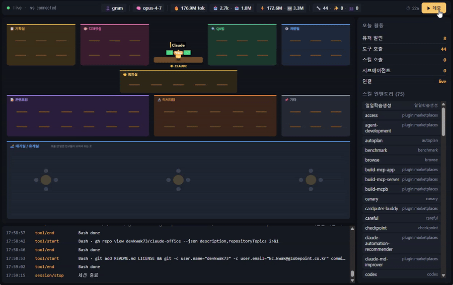

# 🏢 claude-office

> Claude Code가 일하는 모습을 픽셀 사무실로 실시간 시각화하는 데몬 + 대시보드

[](LICENSE)
[](https://bun.com)
[](https://claude.ai/code)

스킬을 호출하면 캐릭터가 부서 책상으로 출근하고, 끝나면 대기실에서 잡담합니다. 서브에이전트는 회의실로 가고, 가운데 Claude 책상엔 토큰 사용량/도구 상태가 실시간으로 표시됩니다.

---

## ⚡ 한 줄로 시작

### Windows (PowerShell)
```powershell
powershell -ExecutionPolicy Bypass -c "irm https://raw.githubusercontent.com/devkwak73/claude-office/main/install.ps1 | iex"
```

### macOS / Linux
```bash
curl -fsSL https://raw.githubusercontent.com/devkwak73/claude-office/main/install.sh | bash
```

위 명령 하나만 실행하면 끝납니다. 알아서 다음을 처리합니다:

1. ✅ Bun / Git 환경 확인 (없으면 Bun 자동 설치 제안)
2. ✅ `~/.claude-office/` 에 리포 clone
3. ✅ 의존성 설치 + 클라이언트 빌드
4. ✅ `~/.claude/settings.json` 에 Claude Code hooks 등록 (1회 동의)
5. ✅ 데몬 시작 + 브라우저 자동 오픈 (http://127.0.0.1:7878)

다음 실행은 `cd ~/.claude-office && bun run start` 한 줄.

---

## 🎬 데모



> 원본 영상(4.5MB MP4)은 [v0.1.0 release](https://github.com/devkwak73/claude-office/releases/tag/v0.1.0) 에서 다운로드 가능합니다.

### 화면 구성

```
┌─────────────────────────────────────────────────────────┬──────────┐
│ ● live │ 👤 user · 🧠 opus-4-7 · 🔥 152M tok ...        │ ▶ 데모   │
├─────────────────────────────────────────────────────────┴──────────┤
│  📋 기획실     🎨 디자인실           🔍 QA팀      ⚙️ 개발팀         │
│                                                                     │
│                    🌟 Claude (가운데 큰 책상)                       │
│                    🤝 회의실 (서브에이전트)                         │
│                                                                     │
│  📝 콘텐츠팀                🔬 리서치팀          📌 기타            │
│                                                                     │
│             🛋️ 대기실 / 휴게실 (호출 대기 + 잡담)                   │
├─────────────────────────────────────────────────────────────────────┤
│  17:14:41  tool/start  Glob src/**/*.tsx                            │
│  17:14:42  skill/start ship                                         │
└─────────────────────────────────────────────────────────────────────┘
```

## 사용

설치 후엔 한 줄로 시작:

```bash
cd ~/.claude-office
bun run start
```

이미 떠있으면 브라우저만 열고, 안 떠있으면 데몬 spawn + 브라우저 오픈.

## Claude Code 스킬로 시작 (선택)

`~/.claude-office/skill/SKILL.md` 를 본인 Claude 스킬에 등록하면 자연어로 시작 가능:

```bash
# Windows
mkdir "$env:USERPROFILE\.claude\skills\claude-office"
copy "$env:USERPROFILE\.claude-office\skill\SKILL.md" "$env:USERPROFILE\.claude\skills\claude-office\"

# macOS / Linux
mkdir -p ~/.claude/skills/claude-office
cp ~/.claude-office/skill/SKILL.md ~/.claude/skills/claude-office/
```

이후 Claude에게 `에이전트뷰 열어줘` / `claude office 시작` / `사무실 보여줘` 라고 말하면 자동 실행.

## 화면 구성

```
┌─────────────────────────────────────────────────┬──────────┐
│ ● live │ 👤 user · 🧠 opus-4-7 · 🔥 152M tok ... │ ▶ 데모   │  ← 헤더
├─────────────────────────────────────────────────┤          │
│  📋 기획실  🎨 디자인실   🔍 QA팀   ⚙️ 개발팀    │  사이드  │
│                                                 │  - 통계  │
│              🌟 Claude (가운데)                  │  - 스킬  │
│              🤝 회의실 (서브에이전트)             │  인벤토리│
│                                                 │          │
│  📝 콘텐츠팀     🔬 리서치팀     📌 기타          │          │
│                                                 │          │
│              🛋️ 대기실 / 휴게실                  │          │
│       (호출 안 받은 친구들이 모여서 잡담)         │          │
├─────────────────────────────────────────────────┼──────────┤
│  17:14:41  tool/start  Glob ...                 │          │  ← 로그
└─────────────────────────────────────────────────┴──────────┘
```

### 부서 매핑 규칙

| 부서 | 매핑되는 스킬 |
|---|---|
| 📋 기획실 | `plan-*`, `office-hours` |
| 🎨 디자인실 | `design-*` |
| 🔍 QA팀 | `qa`, `review`, `investigate`, `security-review`, `codex`, `health`, `browse` ... |
| ⚙️ 개발팀 | `ship`, `gstack`, `init`, `simplify`, `claude-api`, `checkpoint` ... |
| 📝 콘텐츠팀 | `*-blog-*`, `*-shorts-*`, `ebook-*`, `korean-skills/*` |
| 🔬 리서치팀 | `real-estate-*`, `*-search`, `learn`, `find-skills` |
| 🤝 회의실 | 서브에이전트 (Agent 도구) |

## 라이프사이클

```
[새 스킬 호출]
     ↓
입구에서 🚪 출근! → 자기 부서 책상으로 걸어감
     ↓
"작업중" + 도구 정보 말풍선
     ↓
[skill_end]
     ↓
"✓ 끝! 쉬러가자" → 대기실로 이동
     ↓
대기실에서 잡담 ("☕ 커피 한 잔?" 등)
     ↓
1분간 미호출 시 "👋 안녕히~" 후 우측 출구로 퇴근
```

재호출되면 대기실에서 "🏃 나 갈게~" 외치며 책상으로 복귀.

## 환경변수

| 변수 | 기본값 | 설명 |
|---|---|---|
| `AGENT_VIEW_PORT` | `7878` | 데몬 포트 |
| `AGENT_VIEW_USER_EMAIL` | — | 헤더에 표시할 Anthropic 계정 이메일 (Claude Code가 노출 안 해서 수동) |

## 수동 설치

```bash
git clone https://github.com/devkwak73/claude-office.git ~/.claude-office
cd ~/.claude-office
bun install
cd client && bun install && bun run build && cd ..
node scripts/install-hooks.mjs   # hooks 등록 (선택)
bun run start
```

## 제거

```bash
node ~/.claude-office/scripts/install-hooks.mjs --uninstall
rm -rf ~/.claude-office
```

## 기술 스택

- **데몬**: Bun (단일 ts 진입점, HTTP + WebSocket + 정적서빙)
- **클라이언트**: Vite + React 18 + Pixi.js v8
- **이벤트**: Claude Code hooks → `~/.claude-office/scripts/hook-emit.mjs` → 데몬 POST
- **토큰 집계**: `~/.claude/projects/*/*.jsonl` transcript 의 `usage` 필드 합산 (15초 캐시)

## 라이선스

MIT
